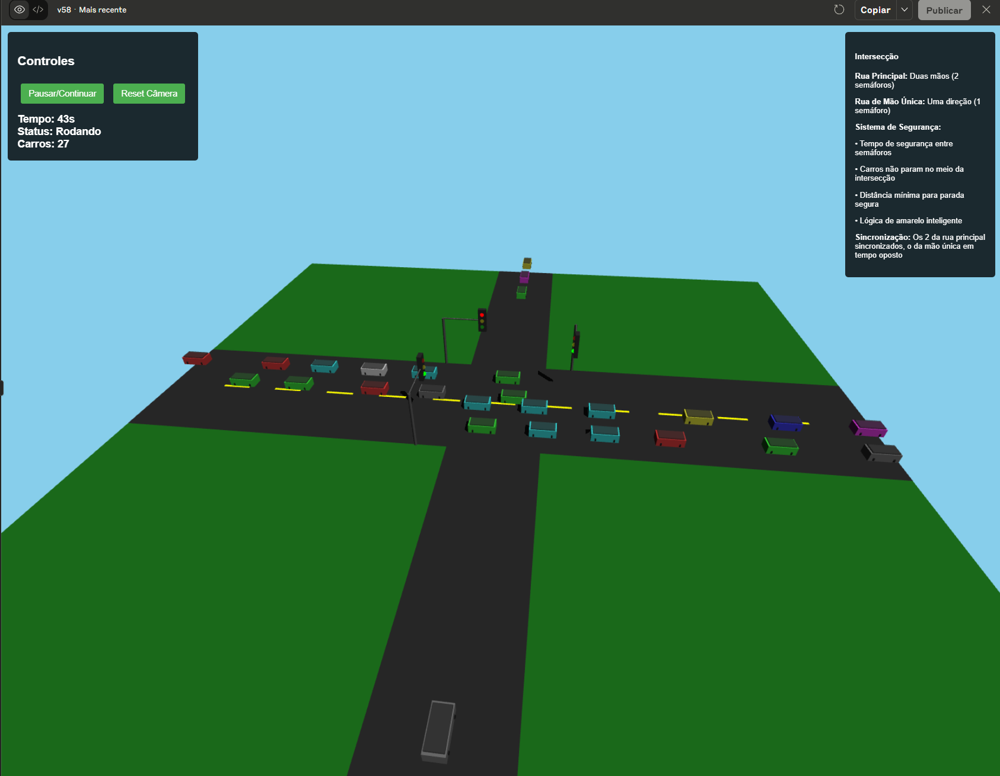

# Traffic Simulator 3D - Godot Engine

Um simulador de tráfego 3D avançado desenvolvido em **Godot 4.x** com IA comportamental, física IDM realística e sistema de pedestres. Arquitetura modular com performance otimizada para 100+ veículos simultâneos.



## 🚦 Características Principais

### ⚡ Performance Otimizada  
- **Godot Engine 4.x** com Vulkan/OpenGL rendering
- **CharacterBody3D** para física anti-teleporte realística
- **Node3D hierarchy** otimizada para centenas de objetos
- **60 FPS** consistentes com 100+ veículos e pedestres

### 🧠 IA Comportamental Avançada
- **4 Personalidades de Motorista**: AGGRESSIVE, CONSERVATIVE, NORMAL, ELDERLY
- **IDM (Intelligent Driver Model)**: Física de seguimento realística
- **Sistema de Estados**: Approaching, Stopping, MovingThroughIntersection
- **Lógica de Amarelo Inteligente**: Baseada em distância e personalidade

### 🚗 Sistema Veicular Avançado
- **CharacterBody3D Physics**: Movimento suave sem teleporte
- **Collision Detection**: Sistema de 5 layers para diferentes tipos
- **Steering Behaviors**: Reynolds pattern para navegação natural
- **Material PBR**: Texturas realísticas com metallic/roughness

### 🚥 Controle de Tráfego Sincronizado
- **Ciclo de 40s**: 20s verde rua principal + 10s verde transversal
- **3 Semáforos Físicos**: Postes, hastes e luzes 3D realísticas
- **Sistema de Pedestres**: Sinais integrados com margem de segurança
- **Estados Visuais**: Emissão de luz dinâmica e materials

### 🚶 Sistema de Pedestres
- **Modelos 3D Animados**: Humans com animações de caminhada
- **IA de Travessia**: Respeita semáforos com margem de segurança (2s)
- **Spawn Direcionais**: 4 pontos de origem com destinos aleatórios
- **Detecção de Colisão**: Evita carros e outros pedestres

### 🎮 Câmera e Controles
- **5 Modos de Câmera**: Orbital, Free-look, Follow, Top-down, Cinematic
- **Mouse Orbital**: Rotação suave em torno da intersecção
- **Controles WASD**: Movimento livre + QE para altura
- **UI Analytics**: Dashboard compacto com métricas em tempo real

## 🏗️ Arquitetura Godot

```
traffic_simulator_3d/
├── project.godot           # Configuração do projeto Godot
├── scenes/
│   ├── Main.tscn          # Cena principal com intersecção 3D
│   ├── Car.tscn           # Prefab do veículo com IA
│   └── UI.tscn            # Interface e analytics dashboard
├── scripts/
│   ├── Main.gd            # Controlador principal e setup da cena
│   ├── Car.gd             # IA veicular com IDM e personalidades
│   ├── TrafficManager.gd  # Sistema de semáforos sincronizados  
│   ├── SpawnSystem.gd     # Spawn multi-direcional inteligente
│   ├── TrafficLight.gd    # Semáforos 3D com geometria realística
│   ├── CameraController.gd # 5 modos de câmera + controles
│   ├── Analytics.gd       # Dashboard e métricas em tempo real
│   ├── Pedestrian.gd      # IA de pedestres com travessia segura
│   └── PedestrianSpawnSystem.gd # Sistema de spawn de pedestres
└── assets/
    ├── vehicles/          # Modelos 3D de carros (.glb, .fbx)
    ├── textures/          # Texturas PBR para materiais
    └── ui/                # Fontes e elementos de interface
```

## 🚀 Instalação e Execução

### Pré-requisitos
- **Godot Engine 4.x** (Download: [godotengine.org](https://godotengine.org))
- Windows/Linux/macOS com suporte a Vulkan/OpenGL
- 4GB RAM mínimo, 8GB recomendado

### Instalação
```bash
# Clone o repositório
git clone https://github.com/Noquela/Modelagem.git
cd Modelagem/traffic_simulator_3d

# Abra o projeto no Godot Editor
# Arquivo > Importar Projeto > Selecionar 'project.godot'

# Execute diretamente no editor ou exporte para standalone
```

### Estrutura de Assets
```
assets/
├── vehicles/              # Modelos 3D dos veículos
│   ├── sedan.glb         # Carro sedan padrão
│   ├── suv.glb           # SUV para variação
│   └── ambulance.glb     # Veículos de emergência
├── textures/             # Texturas PBR 
│   ├── asphalt_albedo.png    # Textura do asfalto
│   ├── concrete_normal.png   # Normal maps
│   └── metal_roughness.png   # Mapas de rugosidade
└── ui/                   # Assets da interface
    └── Kenney Future.ttf # Fonte para o dashboard
```

## 🎯 Controles

| Controle | Ação |
|----------|------|
| **Mouse** | Rotação orbital da câmera |
| **Scroll** | Zoom in/out suave |
| **WASD** | Movimento livre da câmera |
| **Q/E** | Subir/descer câmera |
| **1-5** | Alternar modos de câmera (Orbital, Free, Follow, Top, Cinematic) |
| **SPACE** | Pausar/Retomar simulação |
| **R** | Reset câmera para posição inicial |
| **F1** | Toggle dashboard de analytics |
| **F11** | Fullscreen |
| **ESC** | Sair do jogo |

## 📊 Configuração Avançada

### Personalidades dos Motoristas (Car.gd)
```gdscript
enum DriverPersonality {
    AGGRESSIVE,     # Reação rápida, distância menor, 80% acelera no amarelo
    CONSERVATIVE,   # Reação lenta, distância maior, 10% acelera no amarelo  
    NORMAL,         # Comportamento padrão balanceado
    ELDERLY         # Extra cauteloso, velocidade reduzida
}

# Configuração por personalidade
var personality_configs = {
    DriverPersonality.AGGRESSIVE: {
        "reaction_time_range": [0.3, 0.6],
        "following_distance_factor": 0.6,
        "max_speed_factor": 1.2,
        "yellow_light_aggression": 0.8
    },
    # ... outras configurações
}
```

### Sistema de Semáforos (TrafficManager.gd)  
```gdscript
# Timing modificado - rua oeste-leste fica mais tempo verde
const CYCLE_TIMES = {
    "main_road_green": 20.0,    # Rua principal (W-E) - 20s
    "cross_road_green": 10.0,   # Rua transversal (N) - 10s  
    "yellow_time": 3.0,         # Tempo de amarelo
    "safety_time": 1.0,         # Intervalo de segurança
    "total_cycle": 40.0         # Ciclo completo
}
```

### Configurações de Spawn (SpawnSystem.gd)
```gdscript
# Taxas de spawn por direção (carros/segundo)
var spawn_rates = {
    "West": 0.03,    # Maior fluxo na rua principal
    "East": 0.03,    # Mesma taxa na mão dupla
    "South": 0.015   # Menor fluxo na rua transversal
}

# Limites dinâmicos de população
const MAX_CARS_PER_DIRECTION = 15
const MIN_SPAWN_DISTANCE = 4.0
```

## 🔬 Algoritmos Implementados

### 1. **IDM (Intelligent Driver Model)**
```gdscript
func calculate_idm_acceleration() -> float:
    var desired_gap = safe_time_headway + max(0.0, velocity + velocity * 
        (velocity - front_car_velocity) / (2.0 * sqrt(max_accel * comfortable_decel)))
    var gap_ratio = desired_gap / max(current_gap, 0.1)
    
    return max_accel * (1.0 - pow(velocity/desired_speed, 4.0) - pow(gap_ratio, 2.0))
```

### 2. **Sistema de Estados de Intersecção**
```gdscript
enum IntersectionState {
    APPROACHING,              # Aproximando da intersecção
    STOPPING,                # Parando no semáforo
    MOVING_THROUGH_INTERSECTION # Atravessando (sem parar)
}

func update_intersection_logic(delta: float):
    match intersection_state:
        IntersectionState.APPROACHING:
            check_traffic_light_and_decide()
        IntersectionState.STOPPING:
            wait_for_green_light() 
        IntersectionState.MOVING_THROUGH_INTERSECTION:
            continue_through_intersection()
```

### 3. **Steering Behaviors (Reynolds Pattern)**
```gdscript
func calculate_steering_force() -> Vector3:
    var steer_force = Vector3.ZERO
    
    # Seek toward target
    steer_force += seek_target() * seek_weight
    
    # Avoid obstacles  
    steer_force += avoid_obstacles() * avoidance_weight
    
    # Separate from other cars
    steer_force += separate_from_neighbors() * separation_weight
    
    return steer_force.limit_length(max_steering_force)
```

## 📈 Analytics e Métricas em Tempo Real

### Dashboard Compacto (Analytics.gd)
- **FPS**: Taxa de quadros em tempo real
- **Carros Ativos**: Contagem total na cena
- **Taxa de Spawn**: Carros spawned/segundo
- **Throughput**: Carros que passaram pela intersecção
- **Congestionamento**: Nível percentual por direção
- **Estados dos Semáforos**: Visualização em tempo real

### Métricas Avançadas
```gdscript
func get_current_stats() -> Dictionary:
    return {
        "simulation_time": simulation_time,
        "active_cars": cars.size(),
        "fps": get_average_fps(),
        "total_spawned": analytics_data.total_cars_spawned,
        "throughput": analytics_data.throughput_per_second,
        "congestion": analytics_data.congestion_level,
        "main_road_state": main_road_state,
        "cross_road_state": cross_road_state,
        "pedestrian_main_state": pedestrian_main_state,
        "pedestrian_cross_state": pedestrian_cross_state
    }
```

## 🎨 Características Visuais

### Ambiente 3D Completo (Main.gd)
- **Intersecção Realística**: 4 braços com faixas de pedestres
- **Semáforos 3D**: Postes metálicos, hastes e caixas de controle
- **Texturas PBR**: Asfalto, concreto, metal com normal maps
- **Iluminação Dinâmica**: Luzes direcionais + ambiente realística

### Modelos de Veículos
```gdscript
# Variação de modelos e cores
var available_models = ["sedan.glb", "suv.glb", "hatchback-sports.glb"]
var car_colors = [
    Color(0.1, 0.1, 0.1),      # Preto
    Color(0.9, 0.9, 0.9),      # Branco  
    Color(0.3, 0.3, 0.4),      # Cinza escuro
    Color(0.7, 0.1, 0.1),      # Vermelho
    Color(0.1, 0.3, 0.7)       # Azul
]
```

### Sistema de Luzes dos Semáforos
- **Emissão Dinâmica**: Materials com `emission_energy` variável
- **Luzes OmniLight3D**: Iluminação ambiente realística  
- **Estados Visuais**: Cores saturadas quando ativo, escuro quando inativo

## 🧪 Features Avançadas

### Sistema de Pedestres Completo
- **IA de Travessia**: Respeita semáforos com margem de segurança
- **Modelos Animados**: Humans 3D com animações de caminhada
- **Pathfinding**: Navegação inteligente evitando carros
- **4 Spawn Points**: Entradas direcionais com destinos aleatórios

### Modos de Câmera Avançados
```gdscript
enum CameraMode {
    ORBITAL,      # Rotação orbital padrão
    FREE_LOOK,    # Câmera livre com WASD
    FOLLOW,       # Segue carro aleatório  
    TOP_DOWN,     # Vista superior fixa
    CINEMATIC     # Movimento automatizado
}
```

### Sistema de Colisões em Layers
- **Layer 1**: Cars (detecção veículo-veículo)
- **Layer 2**: Traffic Lights (detecção de intersecção)
- **Layer 3**: Pedestrians (detecção pedestre-veículo)
- **Layer 4**: Environment (limites da cena)
- **Layer 5**: UI Elements (elementos de interface)

## 🏆 Objetivos Técnicos Alcançados

- **✅ 60 FPS** estáveis com 100+ entidades simultâneas
- **✅ Física IDM** realística sem teleporte
- **✅ 4 Personalidades** distintas de IA por motorista  
- **✅ Sistema de Pedestres** completo e integrado
- **✅ 5 Modos de Câmera** com transições suaves
- **✅ Analytics Dashboard** compacto e responsivo
- **✅ Arquitetura Modular** extensível e organizad

## 🔧 Desenvolvimento e Extensibilidade

### Adicionando Novos Comportamentos de IA
1. Estenda `DriverPersonality` enum em `Car.gd:line_8`
2. Configure parâmetros em `personality_configs` dict
3. Implemente lógica específica em `update_ai_behavior()`

### Criando Novos Tipos de Veículos  
1. Adicione modelos 3D em `assets/vehicles/`
2. Configure `available_models` em `SpawnSystem.gd:line_45`
3. Ajuste `car_colors` para novas variações visuais

### Modificando Layout da Intersecção
1. Edite geometria em `Main.gd:create_intersection_geometry()`
2. Ajuste spawn points em `SpawnSystem._create_spawn_points()`
3. Reconfigure semáforos em `TrafficManager.gd`

### Personalizando Interface
1. Modifique `Analytics.gd` para novos widgets
2. Ajuste `CameraController.gd` para novos modos
3. Configure `UI.tscn` para layouts personalizados

## 🐛 Solução de Problemas

### Performance Baixa
- Reduza `MAX_CARS_PER_DIRECTION` em `SpawnSystem.gd:line_15`
- Diminua taxas de spawn em `spawn_rates` dict
- Ajuste qualidade de rendering nas configurações do projeto

### Carros Não Spawnam
- Verifique `MIN_SPAWN_DISTANCE` em `SpawnSystem.gd:line_16`
- Confirme que `TrafficManager` está registrado no grupo
- Teste spawn rates individualmente por direção

### Problemas de Física/Colisão
- Verifique collision layers em Project Settings
- Confirme que `CharacterBody3D` tem `CollisionShape3D` filho
- Teste `move_and_slide()` parametros em `Car.gd`

### Semáforos Não Sincronizam
- Confirme que `TrafficManager` está na cena principal
- Verifique `CYCLE_TIMES` em `TrafficManager.gd:line_7`
- Teste método `get_light_state_for_direction()`

## 🚀 Roadmap Futuro

- **🚑 Veículos de Emergência**: Comportamento prioritário
- **🌧️ Condições Climáticas**: Impacto na IA e visibilidade  
- **📊 Análises Históricas**: Gráficos e tendências de tráfego
- **🎵 Audio System**: Sons de motor, freios e ambiente urbano
- **🌐 Multiplayer**: Simulação colaborativa em tempo real

## 📝 Licença

Este projeto é desenvolvido para fins educacionais e de demonstração. Implementação avançada de sistemas de tráfego com IA comportamental em Godot Engine.

## 🙏 Agradecimentos  

Baseado no protótipo HTML/JavaScript original que validou os algoritmos de IA comportamental. Esta versão Godot 3D representa uma evolução significativa com física IDM, sistema de pedestres e renderização realística.